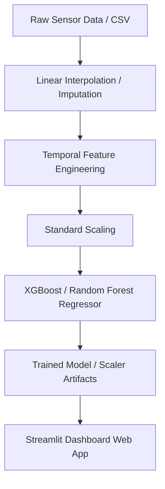

# AeroShield: Air Quality Index (AQI) Prediction Dashboard 🍃

An end-to-end machine learning project and interactive Streamlit web dashboard designed to predict the Air Quality Index (AQI) based on pollutant concentrations and meteorological parameters. 

---

## 📌 Project Overview
AeroShield leverages a regression-based machine learning architecture to estimate AQI in real time. Since air quality is highly seasonal and exhibits clear diurnal patterns, the pipeline includes advanced temporal feature engineering to enhance model sensitivity. The project includes:
1. **Realistic Synthetic Data Generation** (`generate_data.py`) with diurnal and seasonal trends.
2. **Imputation & Feature Engineering Pipeline** (`pipeline.py`) using linear interpolation and cyclical temporal encodings.
3. **Model Training & Evaluation** (`train.py`) utilizing XGBoost (with RandomForest fallback) and standard scaling.
4. **Interactive Dashboard** (`app.py`) featuring sliders for live prediction, CSV uploads for batch forecasting, and Plotly visualizations.
5. **Containerization** (`Dockerfile`) for seamless deployment.

---

## 🛠️ System Architecture & Data Pipeline



### 1. Data Pipeline & Sensor Preprocessing
Air quality sensor data often suffers from missing values due to network glitches or hardware failures. 
* **Sensor Imputation**: We handle missing variables using **linear interpolation**, which is ideal for time-series readings because it preserves localized trends. Boundary cases are resolved with forward-fill (`ffill`) and backward-fill (`bfill`).
* **Temporal Encodings**: AQI patterns vary heavily based on time of day (traffic peaks) and seasonality (winter crop burning, temperature inversion). Instead of passing raw hour/month integers, we project them onto a 2D circular space using sine and cosine transformations:
  $$\text{Hour}_{\sin} = \sin\left(\frac{2\pi \cdot \text{Hour}}{24}\right), \quad \text{Hour}_{\cos} = \cos\left(\frac{2\pi \cdot \text{Hour}}{24}\right)$$
  This guarantees that hour `23` is close to hour `0`, preventing artificial splits in tree-based algorithms.

### 2. AQI Breakpoint Formula
AQI is calculated using piece-wise linear interpolation based on EPA guidelines. The sub-index $I_p$ for pollutant $C_p$ is calculated as:
$$I_p = \frac{I_{high} - I_{low}}{C_{high} - C_{low}} \cdot (C_p - C_{low}) + I_{low}$$
The overall AQI is the maximum of the individual sub-indices:
$$\text{AQI} = \max(I_{PM2.5}, I_{PM10}, I_{NO2}, I_{CO}, I_{SO2})$$

---

## 📁 Repository Structure
* [generate_data.py](file:///c:/Users/amanz/OneDrive/Desktop/Air%20quality%20index/generate_data.py): Creates a mock 2-year hourly dataset with seasonal noise.
* [pipeline.py](file:///c:/Users/amanz/OneDrive/Desktop/Air%20quality%20index/pipeline.py): Loads data, imputes missing records, constructs features, and scales variables.
* [train.py](file:///c:/Users/amanz/OneDrive/Desktop/Air%20quality%20index/train.py): Trains an XGBoost or Random Forest model and stores `.joblib` artifacts.
* [app.py](file:///c:/Users/amanz/OneDrive/Desktop/Air%20quality%20index/app.py): The Streamlit UI dashboard code.
* [requirements.txt](file:///c:/Users/amanz/OneDrive/Desktop/Air%20quality%20index/requirements.txt): Environment dependencies.
* [Dockerfile](file:///c:/Users/amanz/OneDrive/Desktop/Air%20quality%20index/Dockerfile): Multi-stage setup for containerized deployment.

---

## 🚀 Running Locally (Quickstart)

### 1. Set Up Virtual Environment
Create a clean environment and install dependencies:
```powershell
python -m venv .venv
.\.venv\Scripts\activate
pip install -r requirements.txt
```

### 2. Generate Data & Train Model
Run the pipeline and trainer to export joblib artifacts:
```powershell
python generate_data.py
python train.py
```
> [!NOTE]
> Training outputs two files: `models/model.joblib` and `models/scaler.joblib`, along with a `models/feature_importances.csv` evaluation sheet.

### 3. Launch Streamlit Dashboard
```powershell
streamlit run app.py
```

---

## 🐳 Containerization & Deployment

### Build the Image
To build the Docker container:
```bash
docker build -t aeroshield-aqi .
```

### Run the Container
Run the containerized app mapping to port `8501`:
```bash
docker run -d -p 8501:8501 --name aqi-dashboard aeroshield-aqi
```
Open your browser and navigate to `http://localhost:8501` to view the dashboard.

---

## 📊 Model Evaluation Metrics
The model is evaluated using two primary metrics:
* **Root Mean Squared Error (RMSE)**: Measures standard deviation of residuals (prediction errors).
* **Coefficient of Determination ($R^2$)**: Represents the proportion of variance explained by features.
> Typical training performance yields an $R^2 > 0.95$, indicating high correlation to EPA mathematical sub-index maximums.
